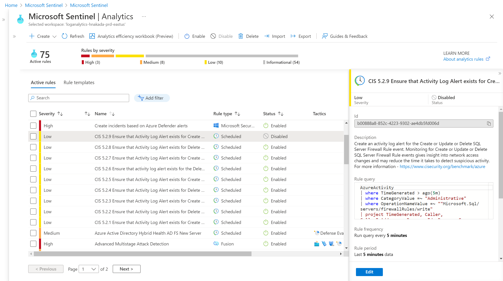

# Azure CIS Benchmark Monitoring Section (5.2.x) by Microsoft Sentinel
This package provides monitoring Azure Activity Log Alerts by Microsoft Sentinel. 
Azure CIS Benchmark guides security recommendations to follow in order to set alerting and monitoring critical activities on an Azure Subscription, and guides alerts rules on Azure monitor. But Azure monitor cannot provide entities, so customer needs to investigate 5W1H (What/Who/When/Where/How). 

Microsoft Sentinel provides analytics rule with detecting entities, so customer gets the benefit for checking User, IP and Azure resources from entities. 
And of course, ingestion cost is *free* for Azure Activity!

# Image


# From Azure CIS Benchmark

- 5.2.1 Ensure that Activity Log Alert exists for Create Policy Assignment (Automated)
  - 


# Analytics template
Here are templates for Analytic rules on Microsoft Sentinel.

| Azure CIS Section | Rule Name | Description |
| --- | ----------- | ------- |
| 5.2.1 | CIS_5.2.1_Ensure that Activity Log Alert exists for Create Policy Assignment |Create an activity log alert for the Create Policy Assignment event.|
| 5.2.2 | CIS 5.2.2 Ensure that Activity Log Alert exists for Delete Policy Assignment |Create an activity log alert for the Delete Policy Assignment event.|
| 5.2.3 | CIS 5.2.3 Ensure that Activity Log Alert exists for Create or Update Network Security Group |Create an Activity Log Alert for the "Create" or "Update Network Security Group" event.|
| 5.2.4 | CIS 5.2.4 Ensure that Activity Log Alert exists for Delete Network Security Group |Create an activity log alert for the Delete Network Security Group event.|
| 5.2.5 | CIS 5.2.5 Ensure that Activity Log Alert exists for Create or Update Network Security Group Rule |Create an activity log alert for the Create or Update Network Security Group Rule event.|
| 5.2.6 | CIS 5.2.6 Ensure that activity log alert exists for the Delete Network Security Group Rule |Create an activity log alert for the Create or Update Network Security Group Rule event.|
| 5.2.7 | CIS 5.2.7 Ensure that Activity Log Alert exists for Create or Update Security Solution |Create an activity log alert for the Delete Network Security Group Rule event.|
| 5.2.8 | CIS 5.2.8 Ensure that Activity Log Alert exists for Delete Security Solution |Create an activity log alert for the Create or Update Security Solution event.|
| 5.2.9 | CIS 5.2.8 Ensure that Activity Log Alert exists for Delete Security Solution |Create an activity log alert for the Delete Security Solution event.|

# How to use
Use [Import-AzSetinelAlertRule](https://github.com/wortell/AZSentinel/blob/master/docs/Import-AzSentinelAlertRule.md) to import yaml template.

```powershell
Import-AzSentinelAlertRule -SubscriptionId (SubscriptionId) -WorkspaceName (WorkSpaceName) -SettingsFile '.\CIS_5_2_1_Ensure that Activity Log Alert exists for Create Policy Assignment.yaml'
```
